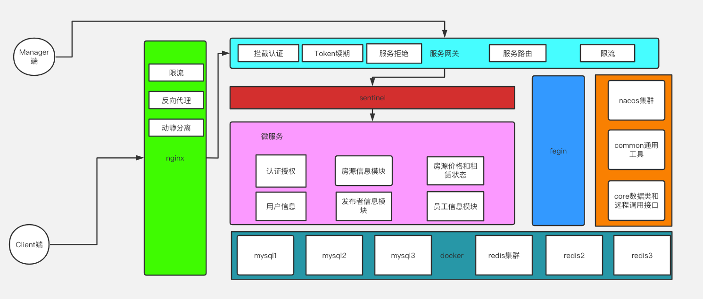

<h1 style="text-align: center">租赁房源系统-HSMS</h1>

简述: 
> Version: 1.0
> 
> Author: HaoTChen 

HSMS 是一个房源租赁信息系统,该系统提供了Client端和Manager端双端RestFul风格开发接口,
以分布式框架模块化设计采用Spring Cloud & Spring Cloud Alibaba相关技术栈完成.

后端技术栈采用:
1. Spring Boot
2. Sentinel
3. Mybatis-Plus
4. Open Fegin
5. Gateway
6. Swagger
7. Redis
8. Mysql
9. Nacos
10. RabbitMQ

其他技术采用
1. Docker
2. Nginx
3. fastdfs

### Other: 
后端地址: https://www.github.com/ggcodec/hsms

前端地址: ...

完成进度:  #############->&nbsp;&nbsp;&nbsp;&nbsp;:85%

#####  Api功能测试文档 ↓↓↓: 

> [链接✋🏻点我](https://www.apifox.cn/apidoc/shared-e74f2ba1-43d4-429e-87a6-c435864e6c26) &nbsp;&nbsp;访问密码:   JzDhPJfd 
##### 文档教程(免费) ↓↓↓
> 语雀地址: ...

架构设计图:
> 1. 系统进行服务模块化拆分,降低服务之间依赖耦合
> 2. 工具类以及核心实体类和远程调用接口进行抽离作为公共服务模块组件提供其他模块引用
> 3. 服务进行集群化部署 解决单点故障
> 4. 服务请求携带token 解决单点登录

