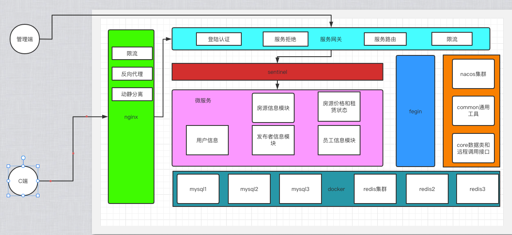

# 租赁房源系统-HSMS

简述: 

HSMS 是一个房源租赁信息系统,该系统提供了Client端和Manager端双端接口,从设计之初考虑使用Spring Cloud 相关技术栈完成.

后端技术栈采用:
1. Spring Boot
2. Sentinel
3. Mybatis-Plus
4. Open Fegin
5. Gateway
6. Swagger
7. Redis
8. Mysql
9. Nacos

其他技术采用
1. Docker
2. Nginx

架构设计图:
> 1. 系统进行服务模块化拆分,降低服务之间依赖耦合
> 2. 工具类以及核心实体类和远程调用接口进行抽离作为公共服务模块组件提供其他模块引用
> 3. 服务进行集群化部署 解决单点故障
> 4. 服务请求携带token 解决单点登录

